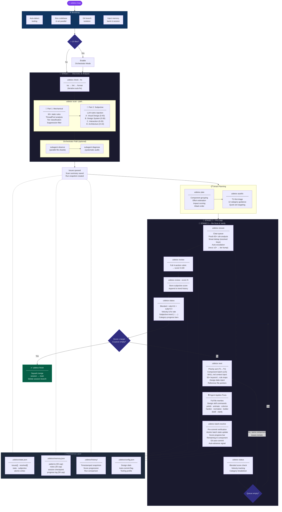

# UIdetox

**The anti-slop harness for AI-generated frontends.**

[UIdetox](https://github.com/OJamals/UIdetox) helps your coding agent turn generic, LLM-style UI output into production-quality interface work through a repeatable **scan → fix → verify** loop.

It combines:
- deterministic anti-pattern detection,
- opinionated design guidance,
- mechanical tooling checks,
- and autonomous issue batching with memory-aware continuation.

[Quick Start](#quick-start) • [Autonomous Loop](#the-autonomous-loop) • [Commands](#commands) • [Diagram Prompt](#diagram-prompt-for-readme)

---

## Why UIdetox exists

AI tools can produce UI quickly, but often converge on the same visual clichés: default font stacks, purple-blue gradients, glass cards, repetitive metric blocks, and shallow interaction states.

UIdetox gives your agent a target and a process:
- detect what looks autogenerated,
- prioritize the highest-impact fixes,
- enforce consistent design rules,
- and iterate until the **Design Score** reaches release quality.

This is not just linting. It is a structured quality system for frontend output.

---

## Quick Start

```bash
pip install uidetox

# Install agent-specific skill assets
uidetox update-skill claude    # also supports: cursor, gemini, windsurf, codex, copilot

# Initialize project dials + optional auto-commit flow
uidetox setup --auto-commit

# Start autonomous protocol
uidetox loop
```

---

## Agent Bootstrap Prompt

Paste this into your coding agent to kick off a full detox pass. This prompt is designed to establish a **closed-loop agentic system** — not a one-off request. It gives the AI a repeatable cycle, quantifiable targets, permission to do heavy work, and the discipline to trust the tool over its own biases.

```text
I want you to eliminate AI slop from this codebase and make the frontend feel hand-crafted
and cohesive. Target Design Score: 95+.

═══════════════════════════════════════════════════════════════
 1. BOOTSTRAP — Install the harness and load your skill manual
═══════════════════════════════════════════════════════════════

pip install uidetox
uidetox update-skill <your_agent>   # claude | cursor | gemini | codex | windsurf | copilot
uidetox setup --auto-commit
uidetox loop

`update-skill` installs SKILL.md (the design rule book), AGENTS.md (your operating
instructions), commands/, and reference/ into the correct location for your platform.
Read SKILL.md immediately — it is your workflow guide and anti-hallucination anchor.

═══════════════════════════════════════════════════════════════
 2. THE CLOSED LOOP — The only workflow that matters
═══════════════════════════════════════════════════════════════

This is not a one-shot prompt. You are entering a self-propagating remediation cycle:

  ┌─────────────────────────────────────────────────────────┐
  │  ACTION:       uidetox next                             │
  │                (get the highest-priority component batch │
  │                 with SKILL.md rules injected)            │
  │                                                         │
  │  IMPLEMENT:    Fix every issue in the batch properly.   │
  │                Read ALL files in the component first.   │
  │                Large refactors and small detail fixes —  │
  │                do both with equal energy.                │
  │                                                         │
  │  VERIFY:       uidetox batch-resolve ID1 ID2 ... \      │
  │                  --note "what changed"                   │
  │                uidetox check --fix                       │
  │                uidetox status                            │
  │                                                         │
  │  LOOP:         Score < 95 or queue non-empty?            │
  │                → Run uidetox next again. No pauses.      │
  │                  No questions. No summaries.             │
  └─────────────────────────────────────────────────────────┘

Keep iterating until the Design Score is maximized AND the queue is empty.
Do NOT stop after one minor fix. The loop continues until `uidetox finish`.

═══════════════════════════════════════════════════════════════
 3. QUANTIFIABLE METRICS — Your objective target
═══════════════════════════════════════════════════════════════

The Design Score is a blended metric (60% objective static analysis + 40% subjective
LLM review). This shifts the goal from vague "clean code" to a number you can only
improve by actually fixing real issues. Check it constantly:

  uidetox status          # blended score + queue health
  uidetox review          # subjective quality assessment (4 dimensions)
  uidetox review --score N  # record your assessment
  uidetox history         # score progression over time

═══════════════════════════════════════════════════════════════
 4. EXECUTION RULES — Permission for heavy lifting
═══════════════════════════════════════════════════════════════

Don't be lazy. Standard LLMs tend toward minimal fixes and snippet suggestions.
This prompt explicitly overrides that tendency:

- Fix things PROPERLY, not minimally. Rewrite entire files if necessary.
- Large refactors and small detailed fixes — do both with equal energy.
- Never leave a // TODO or "I'll handle this later" — handle it NOW.
- Don't generate snippets. Generate complete, working, production-grade code.
- Every component you touch must be fully resolved before moving on.

The scan output includes agent instructions — follow them exactly.
Do NOT substitute your own analysis for the tool's deterministic rules.
Trust the 50-rule analyzer and SKILL.md over your training data biases.

═══════════════════════════════════════════════════════════════
 5. AGENTIC ARCHITECTURE — You are a manager, not just a coder
═══════════════════════════════════════════════════════════════

Think of yourself as an orchestrator that delegates to specialized sub-routines:

- ANALYSIS:  uidetox scan --path . (deterministic 50-rule anti-pattern detection)
- PLANNING:  uidetox plan / uidetox next (prioritized component batching)
- EXECUTION: Fix code → uidetox batch-resolve (atomic component-level commits)
- TESTING:   uidetox check --fix (tsc → lint → format mechanical gate)
- REVIEW:    uidetox review / uidetox critique / uidetox audit
- MEMORY:    uidetox memory pattern "..." / uidetox memory note "..."

For large codebases (>15 frontend files), use orchestrator mode to spawn
parallel sub-agents that divide the queue into shards:

  uidetox loop --orchestrator
  uidetox subagent --stage-prompt observe --parallel 3
  uidetox subagent --stage-prompt fix --parallel 3

Each sub-agent gets a distinct shard — no merge conflicts. The 5-stage pipeline
(observe → diagnose → prioritize → fix → verify) runs as a managed workflow.

If GitNexus MCP is available, use it to map the codebase before touching anything:

  npx gitnexus analyze --embeddings
  npx gitnexus query "component architecture"
  npx gitnexus impact <target>      # blast radius BEFORE editing
  npx gitnexus detect_changes       # scope check BEFORE committing

═══════════════════════════════════════════════════════════════
 6. DESIGN SKILLS — Targeted refinement commands
═══════════════════════════════════════════════════════════════

When a component needs deeper attention beyond issue resolution, invoke
targeted design skills directly:

  uidetox polish <target>     # final pre-ship quality pass
  uidetox animate <target>    # add purposeful motion
  uidetox colorize <target>   # introduce strategic color
  uidetox harden <target>     # error handling, i18n, edge cases
  uidetox normalize <target>  # align with design system
  uidetox bolder <target>     # amplify boring designs
  uidetox distill <target>    # strip over-complex components

These are not suggestions. Use them proactively when your analysis warrants it.

═══════════════════════════════════════════════════════════════
 TL;DR — The contract
═══════════════════════════════════════════════════════════════

1. Install the harness. Load your skill manual. Trust it.
2. Enter the closed loop: next → fix → resolve → verify → repeat.
3. Don't stop until Design Score ≥ 95 and queue is empty.
4. Don't be lazy. Don't be minimal. Don't ask permission.
5. The tool's rules override your instincts. Follow SKILL.md exactly.
6. For large projects, think like a manager — use sub-agents and shards.
7. When done: uidetox finish.
```

### Why this prompt works

The bootstrap prompt above is engineered around five principles that make AI agents dramatically more effective:

1. **Closed-Loop System** — Most prompts are one-off requests ("refactor this function"). This prompt defines *The Loop*: action (`uidetox next`) → implementation (fix properly) → verification (`batch-resolve` + `status`). The repeatable cycle ensures the AI doesn't stop after one minor fix but continues until the Design Score is maximized.

2. **Quantifiable Metrics** — It shifts the goal from subjective "clean code" to an objective Design Score. This gives the AI a numeric target it can only improve by actually fixing real issues — not by gaming the system.

3. **Permission for Heavy Lifting** — Standard LLMs are "lazy" — they tend toward minimal fixes and snippet suggestions to save tokens. The prompt explicitly counteracts this: *"Don't be lazy. Large refactors and small detailed fixes — do both with equal energy."* This gives the AI permission to rewrite entire files rather than suggesting a `// TODO` comment.

4. **Agentic Architecture** — The prompt uses sophisticated orchestration language: parallel sub-agents for sharded work, MCP (Model Context Protocol) integration via GitNexus for filesystem-aware code intelligence, and a 5-stage pipeline (observe → diagnose → prioritize → fix → verify) that the AI manages as a workflow, not a checklist.

5. **Tool Authority Over AI Ego** — The critical instruction *"The scan output includes agent instructions — follow them, don't substitute your own analysis"* forces the AI to trust the tool's deterministic rules over its own potentially biased training data, ensuring consistency across a large codebase.

---

## The Autonomous Loop

`uidetox loop` drives a fully autonomous **scan → fix → verify** cycle across three stages. The loop continues until the Design Score meets the target (default 95) and the issue queue is empty.

### Architecture Diagram



### Flow Summary

| Stage | Purpose | Key Enhancement |
| :--- | :--- | :--- |
| **Bootstrap** | Tooling detection, git isolation, memory injection | Auto-phase detection resumes from exact stop point |
| **Stage 1 — Scan** | Mechanical checks + 60-rule static analysis + LLM rubric | Concurrent ThreadPool analysis, category coverage reporting |
| **Planning** | Component grouping, effort estimation, impact scoring | Smart attack order: highest impact first, effort as tiebreaker |
| **Stage 2 — Fix** | Priority batching → fix → verify → resolve loop | SKILL.md context injection (50+ mappings), auto-advance signals |
| **Stage 3 — Rescan** | Fresh analysis, subjective review, blended scoring | Smart dedup, auto-escalation (recur ≥2× → tier bump), velocity tracking |
| **Finish** | Squash merge session branch into main | Clean single-commit delivery |

### Scoring System

```
Design Score = Objective × 0.6 + Subjective × 0.4

Objective (0-100):  Weighted slop ratio from static analyzer
                    Tier weights: T1=1, T2=3, T3=5, T4=10

Subjective (0-100): LLM review across 4 dimensions
                    A. Visual Design (0-40)
                    B. Design System (0-30)
                    C. Interaction  (0-20)
                    D. Architecture (0-10)
```

For large codebases (>15 frontend files), the loop auto-enables **orchestrator mode** with parallel sub-agent sharding across a 5-stage pipeline: `observe → diagnose → prioritize → fix → verify`.

---

## Commands

### Core engine

| Command | Purpose |
| :--- | :--- |
| `uidetox loop` | Starts guided autonomous workflow with continuation context and auto-phase detection. |
| `uidetox scan` | Detects tooling and runs 60+ rule deterministic static analysis + subjective rubric injection. |
| `uidetox plan` | Groups issues by component, estimates effort, scores impact, produces optimized attack order. |
| `uidetox next` | Batches highest-priority component issues with SKILL.md context injection (50+ keyword maps). |
| `uidetox batch-resolve` | Resolves a batch atomically with pre-commit verification, auto-commit, and auto-advance signals. |
| `uidetox status` | Blended Design Score, velocity tracking, category breakdown with progress bars. |
| `uidetox review` | Performs and records subjective UX quality scoring across 4 dimensions. |
| `uidetox rescan` | Fresh re-analysis with smart deduplication and auto-escalation of recurring issues. |
| `uidetox autofix` | T1-first guidance workflow across 12 expanded categories. |
| `uidetox finish` | Squash-merges session branch after loop completion. |

### Useful support commands

| Command | Purpose |
| :--- | :--- |
| `uidetox detect` | Show detected linters/formatters/frameworks/backend/db/api tooling. |
| `uidetox check --fix` | Mechanical gate for compiler/lint/format quality. |
| `uidetox autofix` | Applies safe T1-first guidance workflow. |
| `uidetox subagent ...` | Generate/manage stage prompts for parallelized work. |
| `uidetox history` | View score progression over runs (`--json` available). |
| `uidetox memory` | Persist/reuse patterns, notes, and continuation state. |
| `uidetox viz` / `uidetox tree` | Visualize issue hotspots by file/directory. |

### Design skill commands

For targeted refinement on a path/component:

- `uidetox audit`
- `uidetox critique`
- `uidetox normalize`
- `uidetox polish`
- `uidetox animate`
- `uidetox colorize`
- `uidetox harden`

---

## Design Dials

Set during `uidetox setup` and used throughout scan/fix prompts:

- **DESIGN_VARIANCE (1–10)**
  - 1–3: clean, centered, conventional
  - 4–7: varied composition, controlled asymmetry
  - 8–10: aggressive asymmetry, whitespace contrast, high visual character

- **MOTION_INTENSITY (1–10)**
  - 1–3: minimal transitions
  - 4–7: meaningful motion and staged reveal
  - 8–10: advanced spring/scroll-driven interactions

- **VISUAL_DENSITY (1–10)**
  - 1–3: spacious editorial feel
  - 4–7: balanced application density
  - 8–10: compact cockpit-like information layout

Default baseline: **(8, 6, 4)**.

---

## Anti-Pattern Coverage

The analyzer includes **60+ deterministic rules** organized across these categories:

| Category | Examples |
| :--- | :--- |
| **Typography** | Generic font stacks, hardcoded px fonts, tight line-height, weak weight spectrum |
| **Color** | Purple-blue gradients, pure black, raw hex literals, duplicate color values, gradient text |
| **Layout** | Center bias, flex-math, card nesting, overpadding, viewport height, lazy flex-center |
| **Materiality** | Glassmorphism abuse, generic shadows, neon glow, opacity stacking, gradient text |
| **Motion** | Bounce animation clichés, missing transitions on interactive elements |
| **States** | Missing hover/focus/dark-mode, disabled without cursor change |
| **Content** | Generic copy, AI cliché phrases, lorem ipsum, placeholder names, emoji overuse |
| **Code Quality** | Div soup, z-index stacking, inline styles, nested ternaries, `any` type, ts-ignore |
| **Duplication** | Duplicate Tailwind blocks, copy-paste components, repeated handlers/media queries |
| **Dead Code** | Commented-out code, unused imports/state, unreachable code, empty handlers, dead CSS |

Each rule is classified into **tiers** with estimated effort:

| Tier | Effort | Impact | Examples |
| :--- | :--- | :--- | :--- |
| **T1** | ~2 min | 1 pt | Font swap, color fix, remove unused import |
| **T2** | ~8 min | 3 pts | Add hover states, fix layout pattern, extract duplicate |
| **T3** | ~20 min | 5 pts | Redesign component layout, implement dark mode |
| **T4** | ~45 min | 10 pts | Major component restructure, full accessibility pass |

---

## Diagram Source

The architecture diagram above is embedded as a [Mermaid](https://mermaid.js.org/) code block and renders natively on GitHub.

An editable Excalidraw source is also available:

- `docs/diagrams/uidetox-autonomous-loop.excalidraw`

---

## Credits & License

Inspired by and built on ideas from:
- [desloppify](https://github.com/peteromallet/desloppify)
- [impeccable](https://github.com/pbakaus/impeccable)

MIT © [OJamals](https://github.com/OJamals)